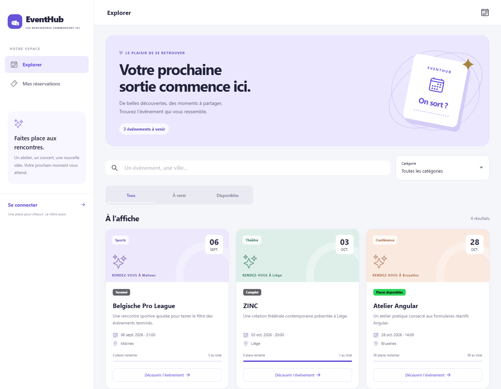
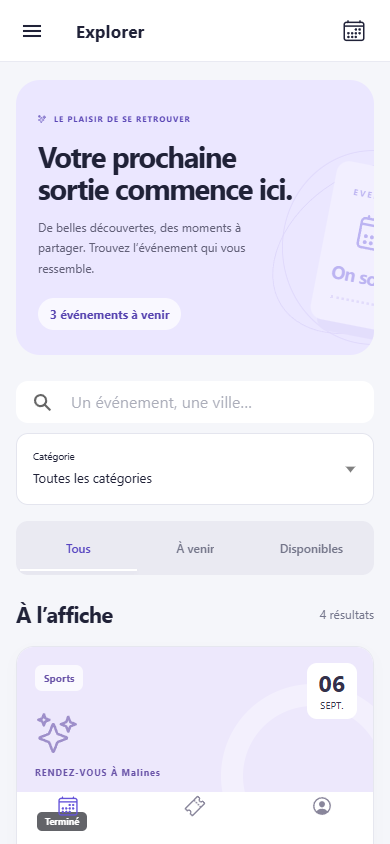

# EventHub Ionic

Une version **Ionic Angular** de la plateforme de réservation EventHub, pensée pour le navigateur et les petits écrans. Elle conserve une API Express/PostgreSQL indépendante et les fonctionnalités de réservation du projet initial.

**Projet original conservé :** [EventHub Reservation Platform](https://github.com/MikeTD24/EventHub-Reservation-Platform). Cette variante reprend sa base au commit `7db6596196d56be81b9496d9526e2d1a5b7d9a92` et met en pratique les conventions de la [démo Ionic du formateur](https://github.com/zachary-BSTORM/Demo-ionic-TF26L028).





## Fonctionnalités

- Agenda public, recherche par texte et lieu, filtres par catégorie et disponibilité.
- Détail d'événement, places restantes et taux de remplissage.
- Inscription, connexion JWT et restauration de session.
- Réservation avec confirmation, modification du nombre de places, annulation et historique.
- Administration des catégories et événements, statistiques et participants.
- Navigation latérale sur ordinateur, barre basse et menu sur mobile.
- Composants Ionic, actualisation par glissement et rechargement au retour sur une page.
- États de chargement, d'erreur et listes vides ; dates affichées en français.

Le backend vérifie les rôles, la propriété des réservations et leur capacité. Les transactions PostgreSQL empêchent deux personnes de réserver la même dernière place. Après le début d'un événement, la réservation ne peut plus être créée, modifiée ou annulée.

## Démarrage sur le PC où le projet est déjà installé

Dans **CMD** :

```bat
cd /d C:\IONIC\EventHub-Reservation-Platform-Ionic
npm start
```

Ouvrir **http://localhost:8100**. Les deux comptes de démonstration, administrateur et participant, sont indiqués dans **LOCAL-ACCESS.md**, un fichier privé exclu de Git.

Dans PowerShell, utiliser `npm.cmd` si l'exécution de `npm.ps1` est bloquée. Il n'est pas nécessaire de modifier la stratégie de sécurité PowerShell.

## Installer une nouvelle copie

Prérequis : Node.js **24.15 ou supérieur dans la branche 24**, npm et PostgreSQL installé. Le setup Windows peut utiliser les binaires PostgreSQL sans changer le service existant.

```bat
npm run install:all
npm run setup:local -- --isolated-postgres
npm start
```

| Service             | Variante Ionic              | Projet original             |
| ------------------- | --------------------------- | --------------------------- |
| Interface           | `http://localhost:8100`     | `http://localhost:4200`     |
| API                 | `http://localhost:3001/api` | `http://localhost:3000/api` |
| Base                | `eventhub_ionic`            | Base d'origine inchangée    |
| PostgreSQL autonome | `127.0.0.1:5433`            | Service d'origine inchangé  |

Le dossier `.local-postgres` contient uniquement l'instance de cette variante. `npm start` la démarre automatiquement lorsqu'elle a été initialisée. `Ctrl+C` arrête l'application ; `npm run db:stop` arrête ensuite cette base locale. Aucun service Windows n'est installé.

Pour un serveur PostgreSQL existant ou un déplacement du dossier : [configuration locale](docs/setup-local.md).

## Technologies et structure

**Ionic 9 · Angular 22 · Capacitor 8 · TypeScript 6 · Express 5 · Sequelize 6 · PostgreSQL · JWT**

```text
EventHub-Reservation-Platform-Ionic/
├── Frontend/
│   ├── src/app/core/          # Modèles, API, session, guards, intercepteur
│   ├── src/app/features/      # Auth, événements, réservations, administration
│   ├── src/environments/      # URL de l'API selon la cible
│   ├── ionic.config.json
│   └── capacitor.config.ts
├── Backend/src/               # API, modèles et règles métier
├── scripts/                   # Installation isolée et tests API
├── tests/                     # Parcours Playwright
└── docs/                      # Guides et captures Ionic
```

Les services Angular communiquent avec de vraies données PostgreSQL : il ne s'agit pas d'une maquette avec des données simulées.

## Vérifier

```bat
npm run build
npm test
npm run test:api
```

Avec l'application démarrée dans un autre terminal et Chrome installé :

```bat
npm run test:e2e
```

Le build est produit dans `Frontend/www`. Express peut le servir en production avec l'API sous la même origine. Voir [les vérifications](docs/verification.md).

## Comprendre et prolonger

- [Passer de la démo du cours à EventHub](docs/ionic-et-angular.md).
- [Configuration locale, PostgreSQL et démarrage](docs/setup-local.md).
- [Capacitor et préparation Android/iOS](docs/mobile.md).

**État mobile :** interface Ionic testée en navigateur sur petit écran ; configuration Capacitor fournie. Aucun APK ni build iOS n'est livré. Pour une exécution native, il reste à configurer une API HTTPS accessible et à compiler avec Android Studio ou Xcode.

## GitHub

Ce projet doit utiliser un dépôt distinct de la version Angular d'origine. Les fichiers `.env`, `LOCAL-ACCESS.md`, la base locale, les dépendances, builds et rapports de test sont exclus par `.gitignore`. Ne jamais ajouter ces fichiers avec `git add -f`.

## Auteur

Mike DJA — mise en pratique d'Ionic dans le cadre de la formation TFTIC26, à partir de son projet EventHub et de la démo du formateur.
